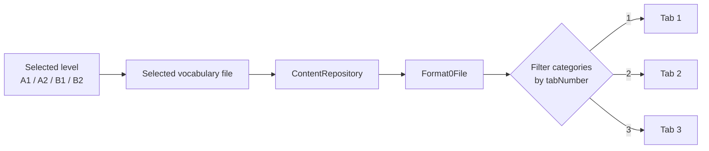
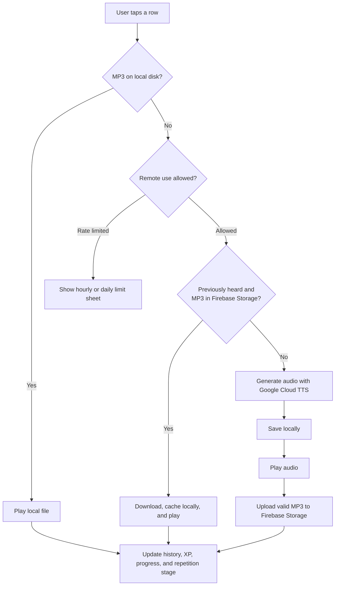
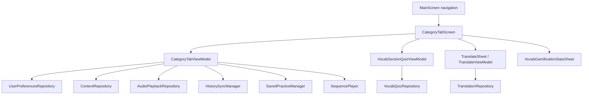

# LanguageExamsAI Android app: functional overview

> **Current scope:** the three main vocabulary tabs (`Tab1`, `Tab2`, and `Tab3`) implemented by `CategoryTabScreen()`.
>
> **Audience:** new users, maintainers, and developers joining the project.
>
> **Last checked against the source:** 9 September 2026.

## At a glance

The first three bottom-navigation tabs are three slices of the vocabulary for the user's selected CEFR level: **A1, A2, B1, or B2**. They use the same screen and interactions; only the `tabNumber` used to filter the vocabulary data changes.

Each tab lets the user:

- browse vocabulary grouped into sections;
- tap a row to hear its example sentence;
- build a three-stage listening habit across separate days;
- swipe a word to save it or view more details;
- play every displayed sentence in a section;
- take a quiz for an individual section;
- translate the most recently played sentence; and
- view progress, XP, streaks, topic completion, and badges.

## How the three tabs are connected

`MainScreen` registers three navigation destinations. Each destination creates the same composable with a different identifier:

| Navigation destination | Screen call | Vocabulary selected |
| --- | --- | --- |
| Tab 1 | `CategoryTabScreen(tabIdentifier = "tab1", ...)` | Categories whose `tabNumber` is `1` |
| Tab 2 | `CategoryTabScreen(tabIdentifier = "tab2", ...)` | Categories whose `tabNumber` is `2` |
| Tab 3 | `CategoryTabScreen(tabIdentifier = "tab3", ...)` | Categories whose `tabNumber` is `3` |

Each destination has its own navigation-scoped `CategoryTabViewModel`. The ViewModel reads the selected level and exam name from `UserPreferencesRepository`, loads the appropriate vocabulary file, and filters its categories by the requested tab number.

### Vocabulary data loading

`ContentRepository.getFormat0Data()` is the central vocabulary loader. At a high level it:

1. reuses an in-progress request for the same logical sheet, if one exists;
2. checks whether a newer remote version is available;
3. uses the in-memory cache when it is current;
4. delegates to `ExamSheetRepository` for disk-cache or network retrieval; and
5. falls back to the vocabulary bundled with the app if retrieval fails.

The English flavour maps the four levels to `vocab_data_a1`, `vocab_data_a2`, `vocab_data_b1`, and `vocab_data_b2`. Other language flavours provide their own configuration and resources.

## Screen layout

From top to bottom, each vocabulary tab contains:

1. **Section shortcut chips** — a horizontally scrolling list of section names. Tapping a chip scrolls the vocabulary list to that section.
2. **Tab progress bar** — shows how many words on this tab have been heard at least once, against the total number of words on the tab.
3. **Translate button (`T`)** — opens the Translate sheet.
4. **Progress/award button** — opens the detailed progress sheet.
5. **Vocabulary sections** — sticky section headings followed by vocabulary rows.
6. **Section controls** — play/pause, quiz status, and quiz or lock controls appear in each sticky heading.

## User controls and gestures

| Action | Result |
| --- | --- |
| Tap a vocabulary row | Plays the first example sentence shown for that word. |
| Swipe right | Opens **More**, showing the word, definition, IPA/pronunciation, play count, and every example sentence. Any sentence in this sheet can be tapped to play it. |
| Swipe left | Toggles the word in the level-specific **Saved practice** list. Saving opens a confirmation sheet and offers an optional practice reminder. |
| Tap a section play button | Plays the first displayed sentence for every word in that section, in order. The button becomes Pause while that section is playing. |
| Tap the same section button while playing | Stops the sequence. |
| Tap a section Quiz button or game-controller icon | Opens that section's vocabulary quiz in a bottom sheet. |
| Tap `T` | Opens translation, initially filled with the last sentence played on the current tab. |
| Tap the award/medal button | Opens the overall progress and achievements summary. |
| Tap quiz dots or stars | Opens a legend explaining the section's quiz status. |

Swiped rows always snap back into place; a swipe performs an action rather than deleting the row.

## Row tap and audio playback

Tapping a vocabulary row stops any current single-sentence playback, remembers that sentence for Translate, and starts the shared audio pipeline. The MP3 name is derived from the sentence and selected voice, so caches remain voice-specific.

The playback waterfall is:

### Important audio rules

- Local audio is always checked first and does not require a network call.
- For ordinary row taps, a non-premium user can be stopped by the hourly or daily rate limiter before remote retrieval or TTS generation.
- The single-row path checks Firebase Storage only when the sentence has previously been heard. A first hearing normally proceeds to Google TTS if the file is not already local.
- A successful Google TTS result is written to internal storage, played, and uploaded to Firebase Storage for later reuse.
- Any successful source—local file, cloud file, or Google TTS—updates the same history and progress records.
- A failed playback displays a snackbar rather than counting the sentence as heard.

## Three-day spaced repetition dots

Every vocabulary row has a separate listening-stage indicator. This is based on **successful hearings on separate local calendar days**, not simply three rapid taps.

| Stage | Dot | Requirement |
| --- | --- | --- |
| 0 | No dot | The sentence has not yet had a qualifying hearing. |
| 1 | Red | First qualifying hearing. |
| 2 | Orange/amber | Another successful hearing on a later calendar day. |
| 3 | Green | A third successful hearing on a later calendar day again. |

Key behaviour:

- Replaying a sentence several times on the same day increases its ordinary play count but does **not** advance the coloured dot again.
- A play can advance only one stage at a time; a long gap cannot jump directly from red to green.
- Release builds compare local calendar dates. Debug builds substitute a short delay so developers can test the progression without waiting for three days.
- The spaced-repetition stage is stored locally in `HistorySyncManager` and is deliberately not sent to Firestore.
- Playing a whole section advances each row by the same rules as an individual row tap.

This row dot is different from the coloured indicators next to a section's Quiz button. The row dot records repeated listening; the section indicators summarize quiz performance.

## Play an entire section

The play button in a section heading passes the first sentence from every word in that section to the singleton `SequencePlayer`.

`SequencePlayer`:

- toggles play/pause for the selected section;
- stops another sequence before starting a new one;
- resolves each track using the same local → cloud → Google TTS waterfall;
- prepares the next track while the current track is playing, reducing gaps between sentences;
- waits for the playback-completed event before moving on;
- applies normal history, XP, progress, and repetition updates to every successful sentence; and
- stops when the user leaves the tab, backgrounds the app, or taps Pause.

Rate limiting is checked once before a non-premium section sequence begins. Once allowed, the sequence is not interrupted by a separate rate-limit check for every track.

## Section quizzes

Each vocabulary section can have its own test. The first section displays a text **Quiz** button; later sections normally display a game-controller icon. A locked section displays a lock instead.

When a quiz opens:

1. `SectionQuizContainer` creates a `VocabSectionQuizViewModel` and calls `loadSectionQuiz(categoryTitle)`.
2. The flavour-specific `SectionQuizKeyMap` converts the displayed, localized section title into a stable quiz key.
3. The ViewModel looks for numbered quiz files under `Quizzes/SectionQuiz/<level>`.
4. `ContentRepository.getFormat13Data()` retrieves each quiz sheet, using its cache/network/bundled fallback.
5. Questions are combined, registered for category-level mastery, paginated, and displayed by `VocabQuizScreen`.
6. Closing the sheet records the completed or partial quiz attempt.

Quiz progress is stored locally by `VocabQuizRepository`. Indicators beside the Quiz button summarize the latest section state:

- **Gold stars:** flawless section runs. Up to three are earned on separate days; three stars mean the section is mastered.
- **Coloured dots after a run with mistakes:** red = struggling, orange = learning, blue = review, green = mastered, and grey = new or unfinished.
- No indicator is shown before the quiz has been attempted.

Quiz buttons are enabled for A1, A2, B1, and B2 when mapped quiz content exists. Access restrictions are applied separately: A1/A2 vocabulary is currently free, while later B1/B2 sections may show a premium lock.

## Translate button

The orange `T` button opens a reusable `TranslateSheet`.

- It is prefilled with the last sentence played on the current vocabulary tab.
- If no sentence has been played—or the user left and returned to the tab—the source field starts blank.
- The sheet supports German ↔ English, including swapping direction, typed input, and device speech recognition when available.
- Translation is performed by the Google Cloud Translation v2 API.
- A German translation can be spoken using the normal audio playback pipeline.

## Progress bar and progress/award sheet

### Tab progress bar

The bar across the screen is implemented by `CacheProgressBar`, but on these tabs its inputs mean **heard words**, not merely cached files:

- the left number is the count of words on this tab whose first displayed sentence has been heard at least once;
- the right number is the total number of words on this tab; and
- the filled proportion is `heard ÷ total`.

The count increases only on a word's first successful hearing. Replays and later spaced-repetition stages do not increase the number again.

### Progress/award button

The award/medal icon opens `VocabGamificationStatsSheet`. This is a wider summary for the selected level and exam, including:

- exam goal/countdown and overall vocabulary progress;
- dynamic study advice;
- XP and level progress;
- consistency heatmap and streak information;
- skill breakdown;
- overall and per-topic mastery; and
- earned badges.

## State and persistence summary

| Information | Owner | Persistence |
| --- | --- | --- |
| Selected level, exam file, voice, and language | `UserPreferencesRepository` | Android DataStore |
| Vocabulary content | `ContentRepository` / `ExamSheetRepository` | Memory, disk/network cache, with bundled fallback |
| Ordinary sentence play counts | `HistorySyncManager` | Local file and eligible for later cloud sync |
| Red/orange/green listening stage | `HistorySyncManager` | Local file only; deliberately excluded from Firestore sync |
| Saved-practice words and reminder time | `SavedPracticeManager` | Local, level-aware saved-practice data |
| Quiz word mastery, section summaries, and attempts | `VocabQuizRepository` | Local JSON files |
| Generated or downloaded MP3 audio | `ContentRepository` / `FirebaseAudioService` | App internal storage; generated audio is also uploaded to Firebase Storage |
| XP, streaks, topic progress, and badges | `XPManager`, `AudioCacheManager`, and quiz/history managers | Managed by their respective repositories/managers |

## Developer flow

### Primary source files

- [`MainScreen.kt`](../src/main/java/com/goodstadt/john/language/exams/packages/MainScreen/MainScreen.kt) — navigation destinations for Tabs 1–3.
- [`CategoryTabScreen.kt`](../src/main/java/com/goodstadt/john/language/exams/packages/CategoryTab/CategoryTabScreen.kt) — Compose UI and bottom-sheet orchestration.
- [`CategoryTabViewModel.kt`](../src/main/java/com/goodstadt/john/language/exams/packages/CategoryTab/CategoryTabViewModel.kt) — tab loading, playback actions, statistics, saving, locks, and section playback integration.
- [`SwipeableVocabRow.kt`](../src/main/java/com/goodstadt/john/language/exams/screens/shared/SwipeableVocabRow.kt) — tap and left/right swipe behaviour.
- [`ContentRepository.kt`](../src/main/java/com/goodstadt/john/language/exams/data/repository/ContentRepository.kt) — vocabulary retrieval and low-level audio cache/cloud/TTS operations.
- [`AudioPlaybackRepository.kt`](../src/main/java/com/goodstadt/john/language/exams/data/repository/AudioPlaybackRepository.kt) — shared playback waterfall and successful-play bookkeeping.
- [`HistorySyncManager.kt`](../src/main/java/com/goodstadt/john/language/exams/managers/HistorySyncManager.kt) — ordinary play history and the local three-day listening stages.
- [`SequencePlayer.kt`](../src/main/java/com/goodstadt/john/language/exams/managers/SequencePlayer.kt) — section-wide sequential playback and one-track-ahead preparation.
- [`CacheProgressBar.kt`](../src/main/java/com/goodstadt/john/language/exams/screens/shared/CacheProgressBar.kt) — compact heard/total progress display used by each tab.
- [`VocabSectionQuizViewModel.kt`](../src/main/java/com/goodstadt/john/language/exams/viewmodels/VocabSectionQuizViewModel.kt) — section quiz retrieval, question generation, paging, and result handling.
- [`VocabQuizRepository.kt`](../src/main/java/com/goodstadt/john/language/exams/data/repository/VocabQuizRepository.kt) — vocabulary quiz mastery and attempt persistence.
- [`TranslateSheet.kt`](../src/main/java/com/goodstadt/john/language/exams/packages/Translate/TranslateSheet.kt) and [`TranslateViewModel.kt`](../src/main/java/com/goodstadt/john/language/exams/packages/Translate/TranslateViewModel.kt) — Translate user interface and state.
- [`TranslationRepository.kt`](../src/main/java/com/goodstadt/john/language/exams/data/repository/TranslationRepository.kt) — Google Cloud Translation request.
- [`VocabGamificationStatsSheet.kt`](../src/main/java/com/goodstadt/john/language/exams/screens/shared/gamification/VocabGamificationStatsSheet.kt) — progress and achievements summary.
- `src/<language>/java/.../config/LanguageConfig.kt` — flavour-specific level/file mapping, defaults, and language settings.
- `src/<language>/java/.../config/SectionQuizKeyMap.kt` — localized section-title to quiz-key mapping.
- `src/<language>/res/raw/vocab_data_<level>.json` — bundled vocabulary fallback for each supported level.
- `src/<language>/assets/Quizzes/SectionQuiz/<level>/` — bundled section-quiz files.

## Maintenance notes

- Keep the distinction between the **row listening dot** and **section quiz indicators** explicit in UI changes and documentation.
- When adding another CEFR level, update the level/file mapping, bundled data, quiz availability list, quiz-key mapping, access policy, and relevant assets together.
- When adding a new category title or translating an existing one, verify that the flavour's `SectionQuizKeyMap` still resolves it to the intended stable quiz key.
- Audio identity includes the selected voice. A voice change may cause a fresh local/cloud/TTS lookup even when the sentence text is unchanged.
- The tab progress bar uses hearing history. Its implementation name (`CacheProgressBar`) should not be taken to mean that every locally cached file is counted.
- `CategoryTabScreen` saves data on pause and stops section playback when the app stops or the screen leaves composition.

## Future documentation sections

This document is deliberately structured so later screens can be added without rewriting the vocabulary-tab overview. Suggested next sections:

- Tab 4: Reference content and reference quizzes
- Tab 5: Me, saved practice, progress, and settings
- Search and global navigation
- Onboarding, level selection, and voice selection
- Premium access and billing
- Notifications and practice reminders
- Data synchronization, analytics, and privacy

